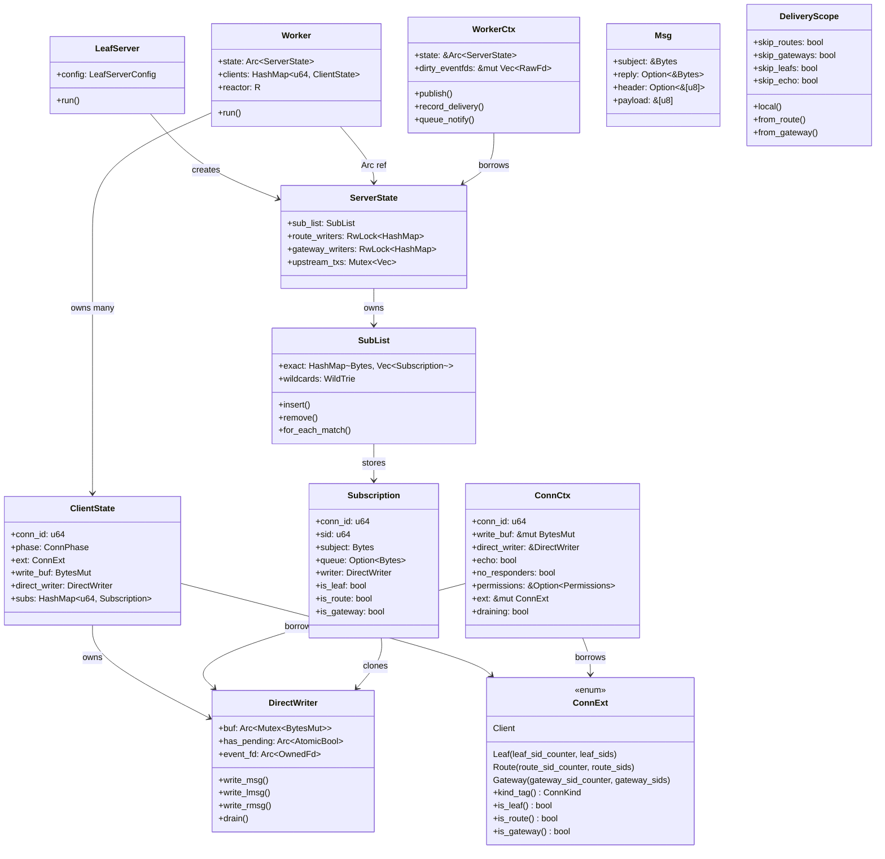
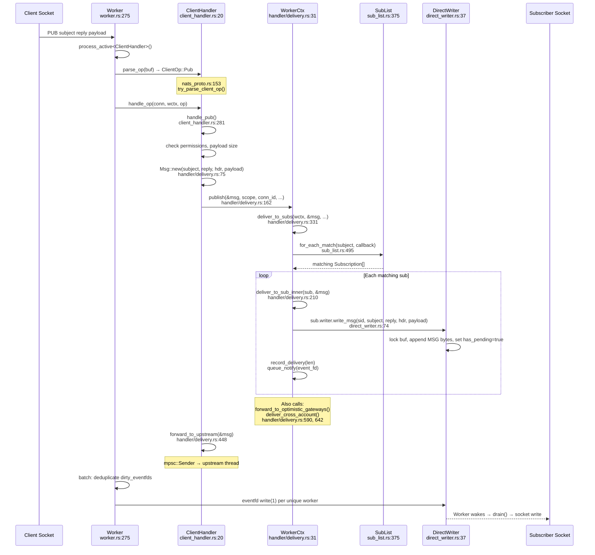
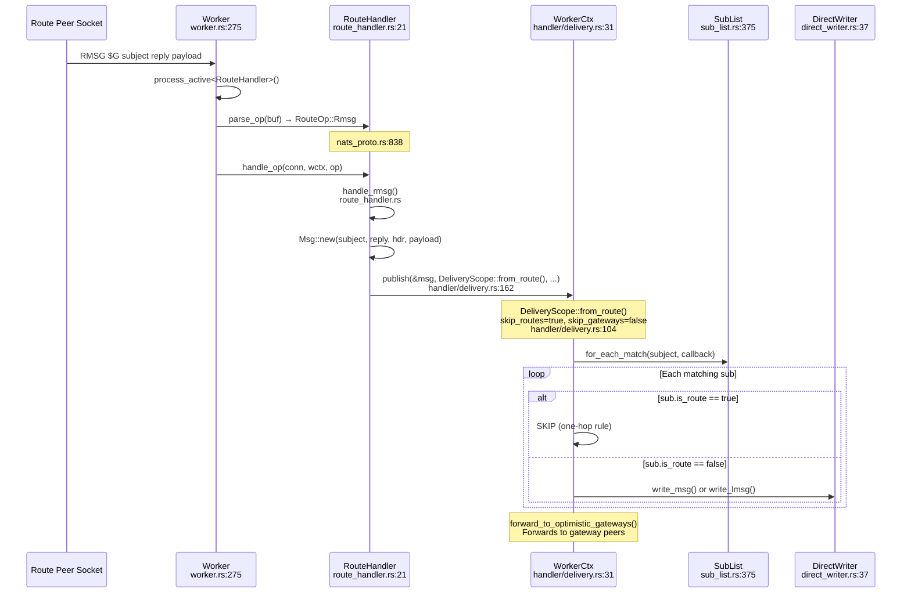
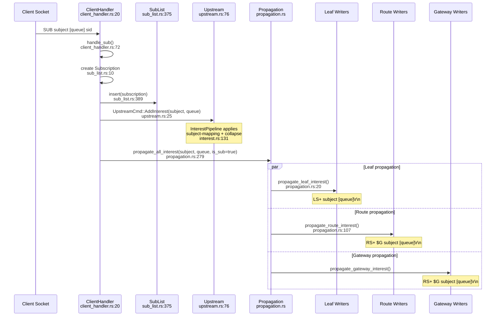
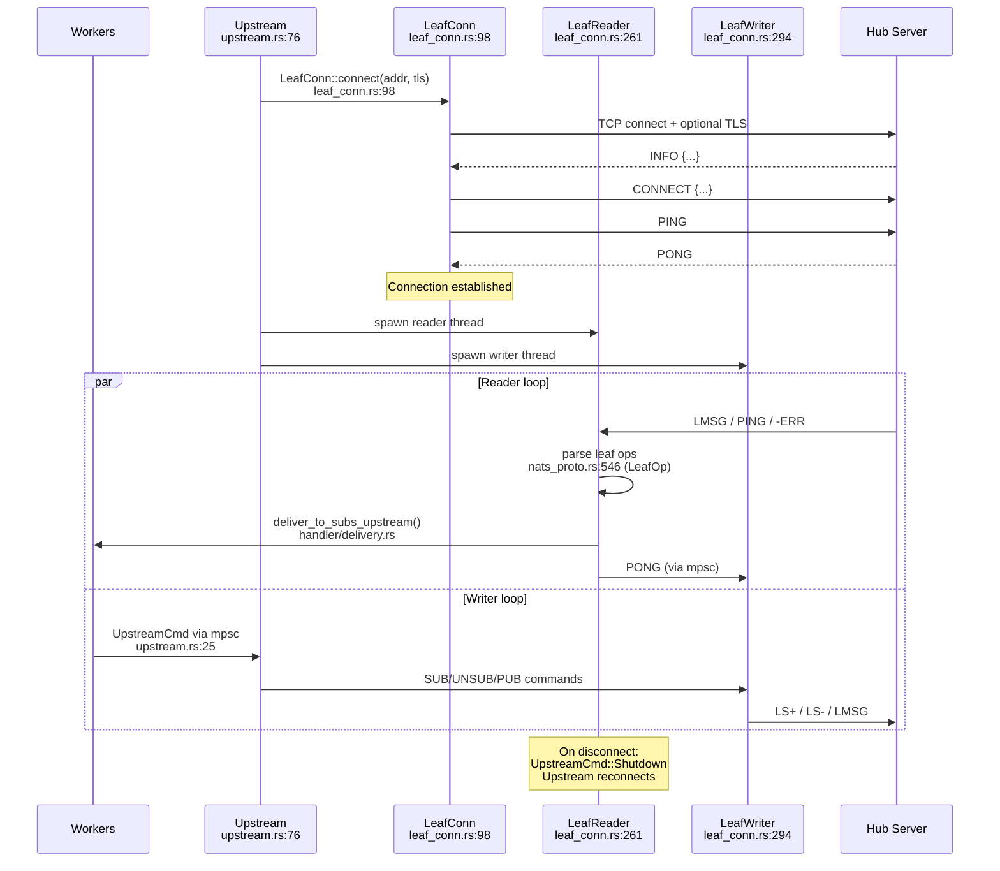
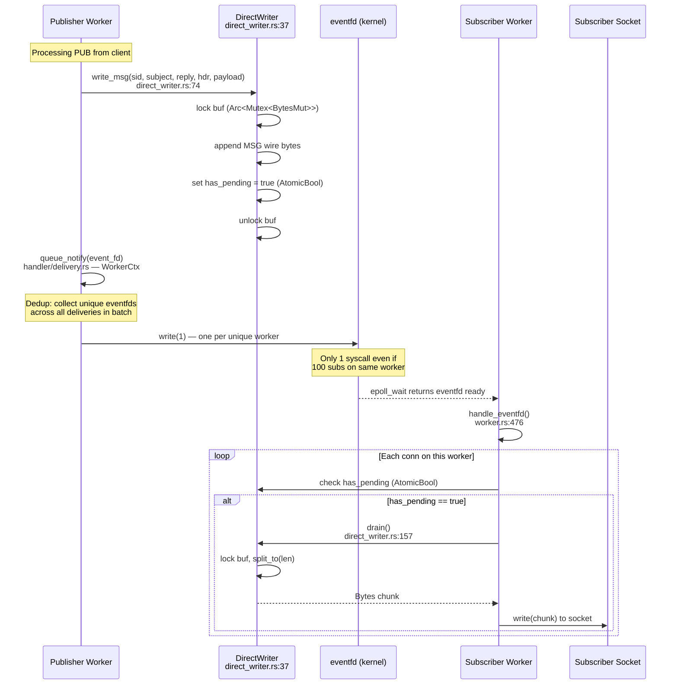
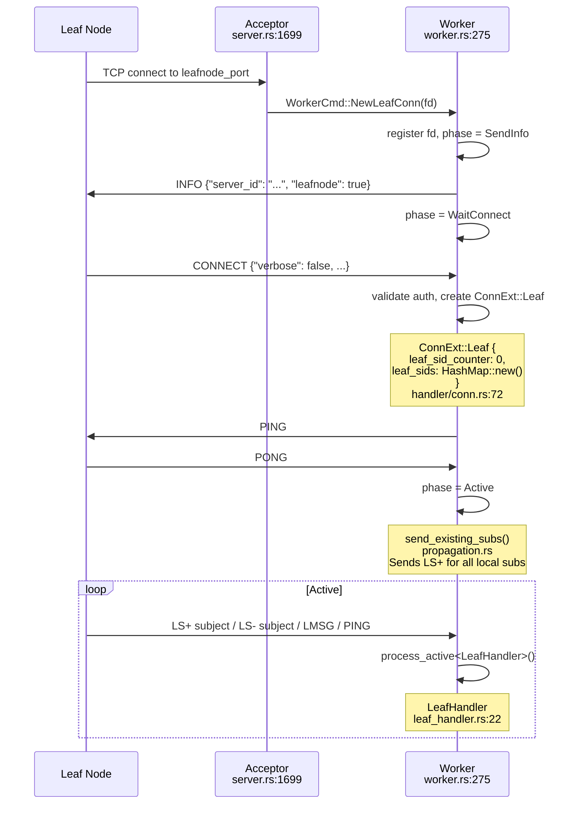
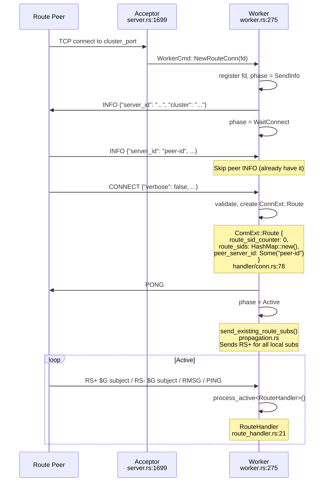
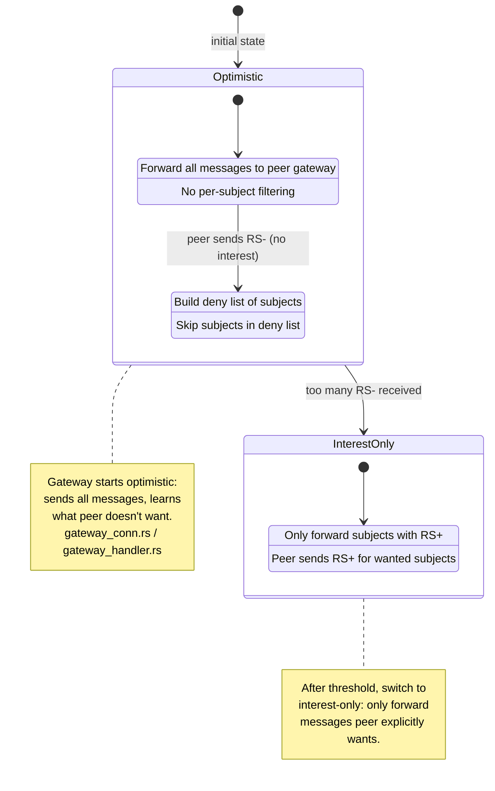

# Low-Level Design — open-wire

Interactive diagrams using Mermaid. Each diagram links types and methods
to source locations (`file:line`) so you can jump straight to the code.

---

## Table of Contents

1. [Type Relationships](#1-type-relationships)
2. [Connection Lifecycle State Machine](#2-connection-lifecycle-state-machine)
3. [Client PUB → Delivery → Socket](#3-client-pub--delivery--socket)
4. [Route RMSG → Local Delivery](#4-route-rmsg--local-delivery)
5. [Client SUB → Interest Propagation](#5-client-sub--interest-propagation)
6. [Upstream Leaf Connection Flow](#6-upstream-leaf-connection-flow)
7. [Worker Event Loop](#7-worker-event-loop)
8. [DirectWriter Cross-Worker Delivery](#8-directwriter-cross-worker-delivery)
9. [Inbound Leaf Handshake](#9-inbound-leaf-handshake)
10. [Inbound Route Handshake](#10-inbound-route-handshake)
11. [Gateway Interest Modes](#11-gateway-interest-modes)

---

## 1. Type Relationships

Core structs and their ownership/reference relationships.



---

## 2. Connection Lifecycle State Machine

Every inbound connection (client, leaf, route, gateway) follows this
state machine in the worker event loop.

> [`ConnPhase`](../src/worker.rs#L178) — `worker.rs:178`

```mermaid
stateDiagram-v2
    [*] --> SendInfo : accept() → register fd
    SendInfo --> WaitConnect : INFO written to write_buf
    WaitConnect --> Active : valid CONNECT received

    state Active {
        [*] --> Processing
        Processing --> Processing : parse_op → handle_op
        Processing --> Flushing : HandleResult::Flush
        Flushing --> Processing : write_buf flushed
    }

    Active --> Draining : server shutdown / drain cmd
    Draining --> [*] : write_buf empty, close fd

    WaitConnect --> [*] : invalid CONNECT / timeout
    Active --> [*] : protocol error (HandleResult::Disconnect)
    Active --> [*] : I/O error / EOF

    note right of SendInfo
        worker.rs — handle_writable()
        Writes INFO JSON to socket
    end note

    note right of WaitConnect
        worker.rs — process_wait_connect()
        Parses CONNECT, validates auth
        Sets echo, no_responders, etc.
    end note

    note right of Active
        worker.rs — process_active()
        Calls H::parse_op() + H::handle_op()
        via ConnectionHandler trait
        handler/conn.rs:25
    end note
```

---

## 3. Client PUB → Delivery → Socket

The most common flow: a client publishes a message that reaches subscribers.



---

## 4. Route RMSG → Local Delivery

A message arriving from a route peer is delivered to local clients only
(one-hop enforcement).



---

## 5. Client SUB → Interest Propagation

When a client subscribes, interest is propagated to upstream, routes,
leafs, and gateways.



---

## 6. Upstream Leaf Connection Flow

The upstream module connects to a hub server using the leaf node protocol.

> [`Upstream`](../src/upstream.rs#L76) — `upstream.rs:76`
> [`LeafConn`](../src/leaf_conn.rs#L98) — `leaf_conn.rs:98`



---

## 7. Worker Event Loop

Each worker thread runs a tight epoll loop processing socket events
and cross-worker notifications.

> [`Worker::run()`](../src/worker.rs#L275) — `worker.rs:275`

```mermaid
stateDiagram-v2
    [*] --> EpollWait

    EpollWait --> HandleEvent : event ready

    state HandleEvent {
        [*] --> CheckFd
        CheckFd --> EventFd : fd == eventfd
        CheckFd --> ListenerFd : fd == listener
        CheckFd --> ClientFd : fd == client socket

        state EventFd {
            [*] --> ReadEventFd
            ReadEventFd --> ScanPending
            ScanPending --> DrainDirectBuf : has_pending == true
            DrainDirectBuf --> WriteSocket
        }
        note right of EventFd
            handle_eventfd()
            worker.rs:476
            Scans ALL conns for pending
            direct_writer data
        end note

        state ClientFd {
            [*] --> CheckPhase
            CheckPhase --> ProcessSendInfo : SendInfo
            CheckPhase --> ProcessWaitConnect : WaitConnect
            CheckPhase --> ProcessActive : Active

            state ProcessActive {
                [*] --> ReadLoop
                ReadLoop --> ParseOp : data available
                ParseOp --> HandleOp : H::parse_op()
                HandleOp --> ReadLoop : HandleResult::Ok
                HandleOp --> FlushAndRead : HandleResult::Flush
                HandleOp --> Disconnect : HandleResult::Disconnect
                ReadLoop --> [*] : WouldBlock
            }
        }
        note right of ClientFd
            process_active<H>()
            worker.rs:2152
            Generic over ConnectionHandler
            handler/conn.rs:25
        end note
    }

    HandleEvent --> FlushPending : all events processed
    note right of FlushPending
        flush_pending()
        worker.rs:809
        Same-worker delivery bypass:
        skip eventfd round-trip
    end note
    FlushPending --> EpollWait
```

---

## 8. DirectWriter Cross-Worker Delivery

How messages cross worker boundaries using shared buffers and eventfd.

> [`DirectWriter`](../src/direct_writer.rs#L37) — `direct_writer.rs:37`



---

## 9. Inbound Leaf Handshake

Hub accepting a leaf node connection.



---

## 10. Inbound Route Handshake

Cluster peer connecting via route protocol.



---

## 11. Gateway Interest Modes

Gateways use two interest modes to optimize cross-cluster traffic.



---

## Source File Index

Quick reference linking diagram elements to source code.

| Type / Function | File | Line |
|---|---|---|
| `LeafServer` | `server.rs` | 1432 |
| `ServerState` | `server.rs` | 1094 |
| `Worker` | `worker.rs` | 275 |
| `ClientState` | `worker.rs` | 218 |
| `ConnPhase` | `worker.rs` | 178 |
| `process_active()` | `worker.rs` | 2152 |
| `flush_pending()` | `worker.rs` | 809 |
| `handle_eventfd()` | `worker.rs` | 476 |
| `ConnectionHandler` | `handler/conn.rs` | 25 |
| `ConnCtx` | `handler/conn.rs` | 46 |
| `ConnExt` | `handler/conn.rs` | 67 |
| `ConnKind` | `handler/conn.rs` | 97 |
| `HandleResult` | `handler/conn.rs` | 179 |
| `WorkerCtx` | `handler/delivery.rs` | 31 |
| `Msg` | `handler/delivery.rs` | 75 |
| `DeliveryScope` | `handler/delivery.rs` | 104 |
| `WorkerCtx::publish()` | `handler/delivery.rs` | 162 |
| `deliver_to_sub_inner()` | `handler/delivery.rs` | 210 |
| `deliver_to_subs_core()` | `handler/delivery.rs` | 258 |
| `deliver_to_subs()` | `handler/delivery.rs` | 331 |
| `forward_to_upstream()` | `handler/delivery.rs` | 448 |
| `handle_expired_subs()` | `handler/delivery.rs` | 503 |
| `forward_to_optimistic_gateways()` | `handler/delivery.rs` | 590 |
| `deliver_cross_account()` | `handler/delivery.rs` | 642 |
| `SubList` | `sub_list.rs` | 375 |
| `Subscription` | `sub_list.rs` | 10 |
| `SubList::insert()` | `sub_list.rs` | 389 |
| `SubList::remove()` | `sub_list.rs` | 397 |
| `SubList::for_each_match()` | `sub_list.rs` | 495 |
| `DirectWriter` | `direct_writer.rs` | 37 |
| `DirectWriter::write_msg()` | `direct_writer.rs` | 74 |
| `DirectWriter::write_lmsg()` | `direct_writer.rs` | 92 |
| `DirectWriter::write_rmsg()` | `direct_writer.rs` | 109 |
| `DirectWriter::drain()` | `direct_writer.rs` | 157 |
| `ClientOp` | `nats_proto.rs` | 153 |
| `LeafOp` | `nats_proto.rs` | 546 |
| `RouteOp` | `nats_proto.rs` | 838 |
| `MsgBuilder` | `nats_proto.rs` | 1194 |
| `try_parse_client_op()` | `nats_proto.rs` | 182 |
| `ClientHandler` | `client_handler.rs` | 20 |
| `handle_sub()` | `client_handler.rs` | 72 |
| `handle_pub()` | `client_handler.rs` | 281 |
| `LeafHandler` | `leaf_handler.rs` | 22 |
| `RouteHandler` | `route_handler.rs` | 21 |
| `GatewayHandler` | `gateway_handler.rs` | 23 |
| `Upstream` | `upstream.rs` | 76 |
| `UpstreamCmd` | `upstream.rs` | 25 |
| `LeafConn` | `leaf_conn.rs` | 98 |
| `LeafReader` | `leaf_conn.rs` | 261 |
| `LeafWriter` | `leaf_conn.rs` | 294 |
| `InterestPipeline` | `interest.rs` | 131 |
| `propagate_all_interest()` | `propagation.rs` | 279 |
| `propagate_leaf_interest()` | `propagation.rs` | 20 |
| `propagate_route_interest()` | `propagation.rs` | 107 |
